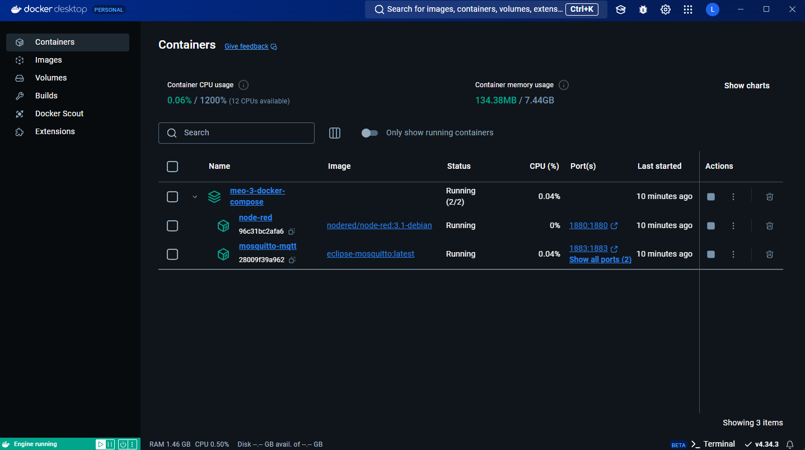
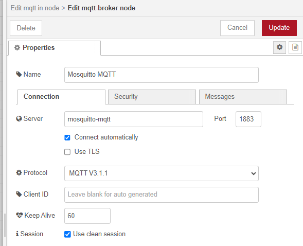

# Example: MEO 3 Docker Compose

This is the docker compose setup for MEO 3 project. The compose included Mosquitto and Node-RED. Noticing that this is still the early version of the setup, and it is not recommended to use in production environment.

## Prerequisite

- Docker (recommended Docker Desktop): You can download Docker Desktop from [here](https://www.docker.com/products/docker-desktop)
- Docker Compose (should be included in Docker Desktop installation)

Check if Docker is installed by running the following command.

```bash
docker --version
```

Docker Compose is included in Docker Desktop installation. You can check if Docker Compose is installed by running the following command.

```bash
docker-compose --version
```

## Setup

1. Clone the repository to your local machine

```bash
git clone https://github.com/MEO-3/meo-3-docker-compose.git
```

2. Change directory to the cloned repository that contains the `compose.yml` file

```bash
cd meo-3-docker-compose
```

3. Run the docker compose command to start the services

```bash
docker-compose up -d
```
Note: This command should only be run on the first time you start the services. If you have started the services before, it is recommended to start/stop the services using Docker Desktop GUI.



## Accessing Node-RED

After the services are up and running, you can access the Node-RED interface by opening your browser and go to `http://localhost:1880`.

## Accessing Mosquitto

The Mosquitto MQTT broker is running on port 1883. You can use any MQTT client to connect to the broker.

For Node-RED accessing Mosquitto, you can use the `mqtt` node and set the broker address to `mqtt://mosquitto-mqtt:1883`.



For other MQTT clients from different devices, the device needs to connect to the same network as the machine that runs the docker compose setup. Then, you can use the IP address of the machine to connect to the Mosquitto broker.
- First, find the IP address of your machine that runs the docker compose setup. You can use the following command to find the IP address (IPv4).
```bash
ipconfig # Scroll down to find the IPv4 address at Wireless LAN adapter Wi-Fi
```
- Then, use the IP address to connect to the Mosquitto broker. For example, if the IP address is `192.168.0.1` then the broker address is `mqtt://192.168.0.1:1883`.

## Stopping the Services

To stop the services, you can run the following command in the same directory as the `compose.yml` file.

```bash
docker-compose down
```

or you can stop/start the services by using Docker Desktop GUI.

## Version

This docker compose setup is still in the early version of MEO 3 project. In this version original Mosquitto and Node-RED images are used. The images are not modified to fit the project requirements.

- v1.0: Initial version with original Mosquitto and Node-RED images (Depricated)
- v1.1: Add custom nodes specify for MEO 3 Project
- v2.0: Add MEO Link IoT to control devices

In version: v2.0
- Currently, MEO Link node is added to the Node-RED. However, the node is only supporting turning on/off the devices. The node is not supporting other features such as changing the color of the light bulb or other features.
- In the future version, the MEO Link node will be updated to support more features.